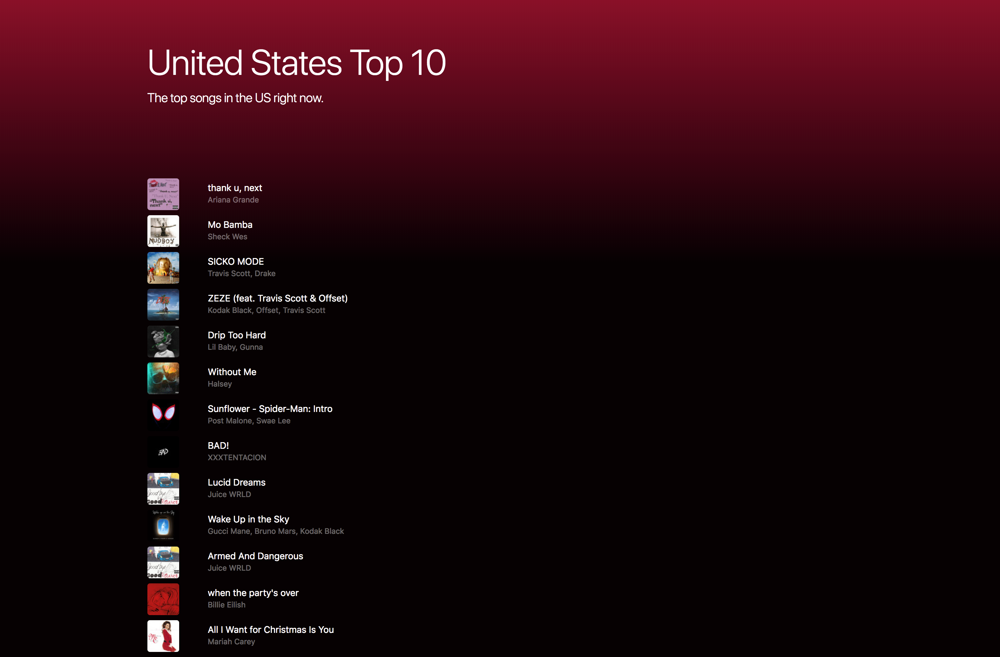

# Dynamic Song Playlist

In the past we've worked with a javascript object that held songs from the top songs in the United States right now. We will be using that same object to dynamically populate the webpage so the user can see all the songs in the playlist.

### Final Result:

### Task:

- Don't modify any of the CSS
- Use the given HTML and Javascript files
- Dynamically render the songs from the given playlist object
